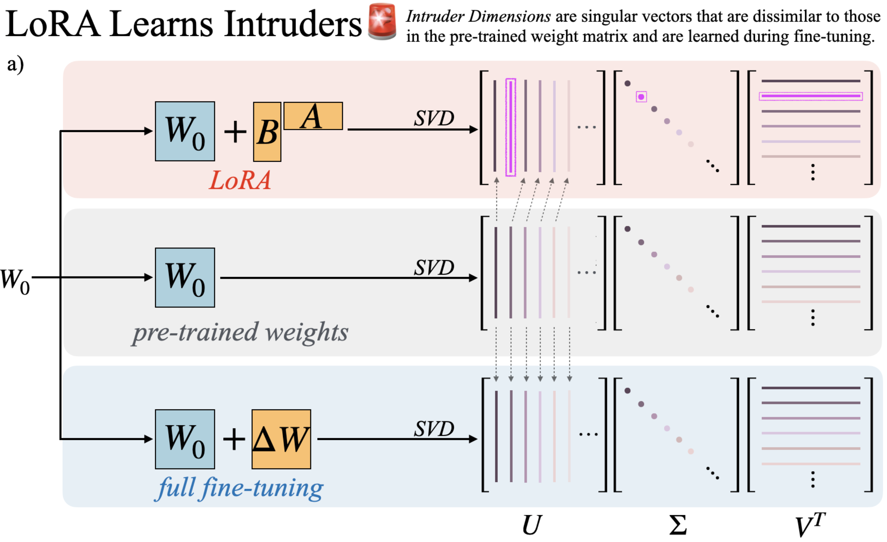

## LoRA vs Full Fine-tuning: An Illusion of Equivalence

### Reece Shuttleworth, Jacob Andreas, Antonio Torralba, Pratyusha Sharma

This repository describes how to recreate the findings found in this paper.

### Setup

1. Make environment.

- Using venv:

```
python -m venv {env_name}
source {env_name}/bin/activate
```

- Using conda:

```
conda create --name {env_name} python=3.10
conda activate {env_name}
```

2. Install requirements.

```
pip install -r requirements.txt
```

### Usage

1. Recreate fine-tuning

see `bash_scripts/recreate_mnli_finetuning.sh` or below for an example of how to use:

```
python finetuning.py \
   --base_model=roberta-base \
   --task=mnli \
   --method=lora \
   --rank=1 \
   --lora_alpha=2 \
   --tune_layers=all_linear \
   --learning_rate=3e-4 \
   --batch_size=16 \
   --num_epochs=5 \
   --steps_per_validate=1000 \
   --max_seq_length=512 \
   --save_result=True
```

2. Search for Intruder Dimensions

```
python find_intruder_dimensions.py \
   --intruder_dimension_threshold=0.5 \
   --model_path=trained_checkpoints/{name_of_finetuned_checkpoint} \
   --base_model=roberta-base
```

### Citation:

```
@misc{shuttleworth2024loravsfinetuningillusion,
      title={LoRA vs Full Fine-tuning: An Illusion of Equivalence},
      author={Reece Shuttleworth and Jacob Andreas and Antonio Torralba and Pratyusha Sharma},
      year={2024},
      eprint={2410.21228},
      archivePrefix={arXiv},
      primaryClass={cs.LG},
      url={https://arxiv.org/abs/2410.21228},
}
```
